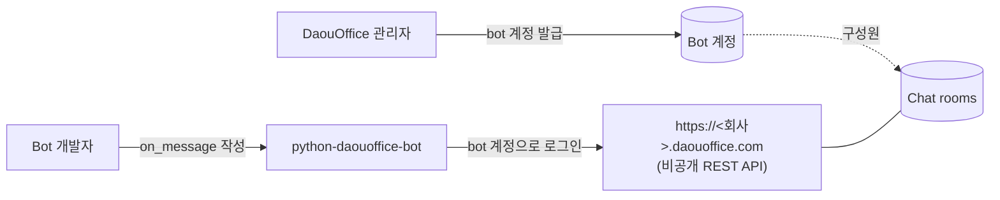
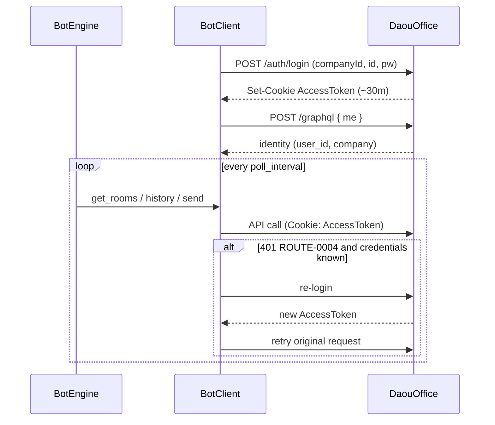
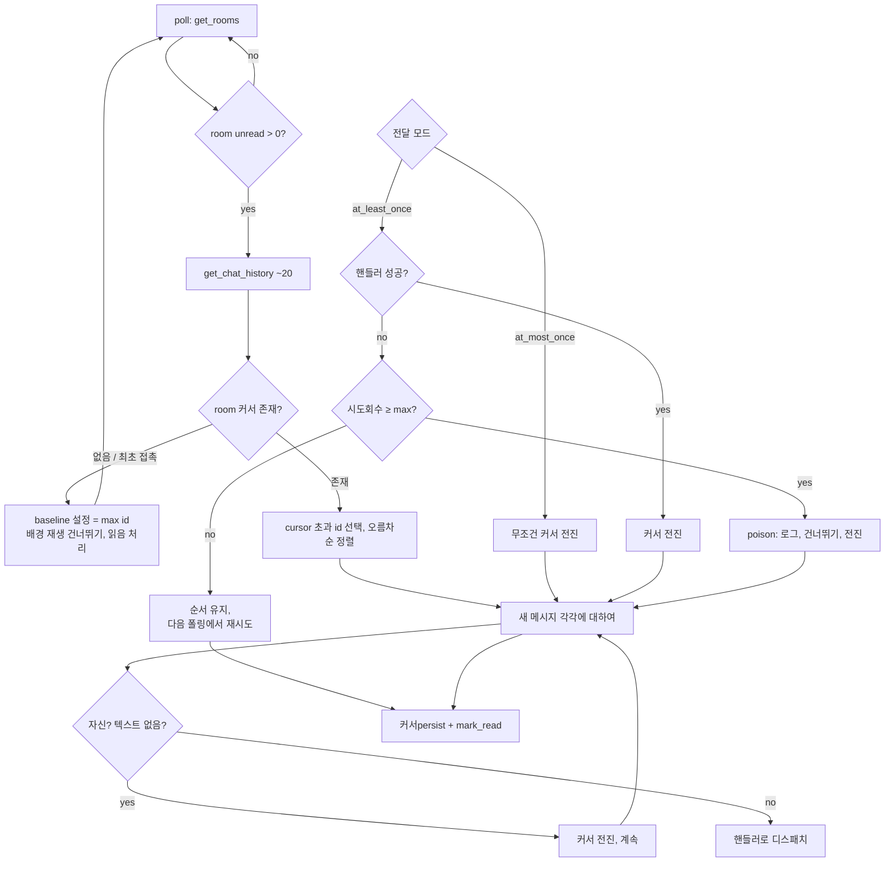
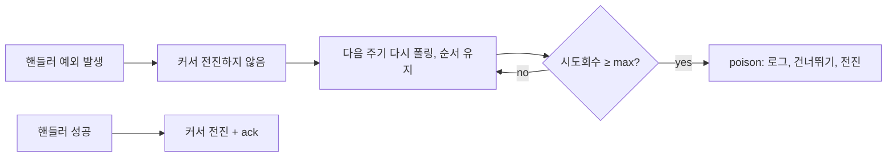

# 아키텍처

`python-daouoffice-bot`의 설계와 **그 이유**. 이 문서는 SDK를 빌드하면서 도출한 결정들을 기록한 것으로, 기여자들을 위한 레퍼런스입니다.

## 1. 컨텍스트

DaouOffice 메신저에는 **공식 bot API가 없습니다**. 이 SDK는 PC 메신저가 사용하는 비공개 REST API를 통해 동작하며, Fiddler(SAZ) 캡처를 통해 재구성했습니다. **BotFather와 같은 등록 시스템이 없습니다** — bot은 자동화를 위해 관리자가 발급하는 일반 DaouOffice 계정입니다. 채팅방 구성원인 것 **그 자체가 연결**이며, 채팅별 설치/OAuth 단계가 필요 없습니다.

### 왜 이 프로젝트가 필요한지, 일반 bot 플랫폼과 어떻게 다른지

Telegram/Slack/Discord는 bot *플랫폼*을 제공합니다: 등록 시스템(BotFather / 앱 + OAuth / 개발자 포털), 토큰, 범위화된 권한, 푸시 전달(웹훅 /_events_ / Gateway). DaouOffice에는 **그것이 전혀 없습니다** — 공식 bot API 자체가 없습니다. DaouOffice를 사용하는 조직에서도 ChatOps, 알림, 비서가 필요하므로, 유일한 경로는 PC 메신저의 비공개 REST API를 리버스 엔지니어링하는 것입니다. 이 프로젝트는 각 팀이 이를 다시 유도하지 않도록 합니다 — 아래 비직관적인 운영 제약사항들까지 함께.

Bot 생성 *절차*가 근본적으로 다르며, 이 차이가 SDK의 모든 설계를 주도합니다:

| Telegram/Slack과의 차이 | 이 SDK의 설계 영향 |
|---|---|
| 등록 시스템/토큰 없음 — bot은 관리자가 발급하는 **일반 계정** | Auth는 계정 로그인; GraphQL `me` 정의로 신원 확인; 토큰 붙여넣기 대신 `daoubot discover`/`login` 온보딩 |
| 채팅별 설치 없음 — **구성원 = 연결** | `connect` 단계 없음; 대신 `RoomRouter` 허용 목록으로 어느 방에 끌려와도 모든 방에서返信하지 않도록 제한 |
| 계정 권한, 범위화되지 않은 bot 토큰 | **전용 계정** 필수; `mark_read`는 계정 전역 (§6) |
| 푸시 없음 — **폴링**해야 하는 공유 REST API | per-room 커서, at-least-once, restart-resume을 가진 폴링 엔진 (§4–5) |
| ~30분 세션, refreshToken 엔드포인트 없음 | 401 시 투명 재로그인 (§3) |
| 기업별 SaaS, 미문서화 | 하드코딩 없음 멀티-텐넌트; 모든 항목에 "SAZ 기반 / 라이브 미검증" 태그 |

따라서 이 SDK는 "DaouOffice용 Telegram 스타일 프레임워크"가 아닙니다 — 이것은 *그 절차와 그 영향*을 캡슐화한 것입니다. 이 문서의 나머지는 각 영향에 대한 근거입니다.

### 대상外 (Non-goals)

- **LLM 프레임워크 아님**. LLM 호출은 개발자의 `on_message`에 있으며, SDK 내부에는 없습니다.
- **특정 테넌트에 묶이지 않음**. 모든 테넌트 값(`base_url`, `company_id`, 신원)이 공급 또는 자동 해결되며, 하드코딩되지 않습니다.
- **폴링 전용**. 캡처에서 WebSocket/STOMP 엔드포인트를 확인했지만 검증하지 않았으므로 **구현하지 않았습니다** (추측성 코드 미출시); 향후 작업을 위한 리버스엔지니어링 노트로만 문서화.

## 2. 구성 요소

| 구성 요소 | 책임 |
|---|---|
| `BotClient` | 상태 없는 REST 래퍼: 로그인, GraphQL `me` 신원, 방, 메시지, 읽음 확인. 멀티-테넌트. 401 시 자동 재로그인. |
| `BotEngine` | 폴링 루프, per-room 순서 디스패치, 커서/ack, 전달 보장. |
| `DaouBot` | 고수준 페사드: client + engine 연결, `on_message` 노출. |
| `RoomRouter` | 허용 목록 기본 per-room 핸들러 디스패치. |
| `CursorStore` | "얼마나 처리했는지"를persist하는 곳(`Memory` / `File`). |
| `Profile` | CLI 세션/신원persist로 명령이 재인증없이 작동. |

레이어링 원칙: **전송/북키핑은 엔진/client에, 개발자는 순수 `on_message`만 작성**. 이것은 Telegram/Discord/Matrix/Kafka 클라이언트를 모방한 것으로, 컨슈머 오프셋이 프레임워크 소유이고 애플리케이션 코드가 아닙니다.

## 3. 인증 & 세션 수명주기

AccessToken JWT 수명은 ~30분; 전체 SAZ 캡처에는 **토큰 새로고침 엔드포인트가 보이지 않습니다**. DaouOffice는 계정당 많은 동시 세션을 허용합니다. 따라서 복구 전략은 **401 시 재로그인**(`ROUTE-0004`)이며, 이것은 fresh login이又一个 세션일 뿐이므로 안전합니다.

`company_id`는 인증 없이 `/api/portal/public/auth/company`(`data.companyList[0]`)에서 발견할 수 있어, `daoubot discover` / `daoubot login` 온보딩을 지원합니다.

## 4. 폴링 & 커서 흐름

유일한 진입 신호는 방별 `unreadMessageCount > 0` — 본질적으로 **수준 트리거드**(읽힐 때까지 HOT 상태). 엔진은 per-room 커서(`chatMessageId`)를 사용하여 순서대로 정확히 추적된 전달로 이를 변환합니다.

**최초 접촉 바뀐선**: 첫 번째로 방을 확인할 때 배경 메시지 재생은 **하지 않습니다** — 봇이 실행 중에 도착한 메시지만 반응합니다. 그 후 persist된 커서가 restart 후 이행을 주도합니다.

## 5. 전달 보장 (수정: at-least-once)

커서 전진 == 메시지 확인, 따라서 *언제* 전진하는지가 보장 수준을 정의합니다. 이 SDK는 이를 knob으로 노출하지 않습니다: **at-least-once는 메시지 전달 산업 표준**(Kafka/SQS/Slack/Telegram)이며 채팅 bot의 올바른 기본값입니다("사용자의 메시지를 조용히 버리지 않음"). at-most-once를 모드 옵션으로 제공하는 것은 대부분 실수로 인한 조용한 메시지 손실을 초래할 것입니다.

- SDK는 *전송* at-least-once를 보장합니다 — **비즈니스 중복 방지는 핸들러의 역할** —중복 응답이 중요하다면 `on_message`를 중복 방지(idempotent)로 작성하세요.
- 실패한 메시지는 방별로 **순서대로** 재시도되며(붙인 메시지가 새 메시지를 차단), 성공하거나 `max_attempts`에 도달하면 poison → 건너뛰기로 처리.
- 읽음 확인도 이를 따릅니다: last acked 메시지까지만 읽음 처리, 실패한 것은 안 읽은 상태로 유지되고 다시 폴링; 대기중인 것이 없을 때만 방이 완전히 정리됩니다.
- **파이어 앤 포킷**은 별도 모드가 아닙니다 — 자신을 swallow하는 핸들러는 결코 실패하지 않으므로 재시도되지 않습니다 (userland 탈출구).

> 의사 결정 기록: 초기 버전에서 `delivery=` knob(`at_least_once`/`at_most_once`, epoll 모드 스타일)을 노출했습니다. 제거되었습니다: 전달-semantics 선택은 분산 시스템 결정을 모든 bot 작성자에게 오펠드하며 at-most-once 경로는 조용한 손실 함정입니다. 표준이 있습니다 — SDK는 결정을 위임하지 않고 이를 따릅니다.

## 6. 디스크 상태 (`.daoubot/`, gitignored)

| 파일 | 작성 주체 | 내용 | 민감도? |
|---|---|---|---|
| `profile.json` | `daoubot login` | 테넌트 + 신원 + 세션 토큰 | 토큰 예 (비밀번호 없음) |
| `cursors.json` | 엔진 (`FileCursorStore`) | `room_id → 마지막 처리 id` | 아니요 |

## 7. 주요 결정

| 결정 | 근거 |
|---|---|
| 멀티-테넌트, 하드코딩 값 없음 | DaouOffice는 기업별 SaaS; 라이브러리는 모든 테넌트를 지원해야 함. |
| GraphQL `me`를 통한 신원 자동 해결 | 하드코딩 봇 user id 제거 필요; 자신의 메시지 건너뛰기 위해 필요. |
| 401 시 재로그인, RefreshToken 아님 | SAZ에 새로고침 엔드포인트 없음; 다중 세션 허용 특성상 재로그인 안전. |
| 커서/ack를 엔진이 소유 | 관례적 접근 (Telegram/Kafka/Matrix); 플랫폼에 서버 측 큐가 없으므로 핸들러에 오펠드하면 모든 작성자가 분산 시스템 문제를 해결해야 함. |
| 전달 at-least-once로 고정 (knob 없음) | 메시지 전달 표준; 구성 가능한 at-most-onice는 조용한 손실 함정. 표준 따르고 결정 위임하지 않기. |
| RoomRouter = 기본 허용 목록 | 봇 계정은 어떤 방에도 끌려갈 수 있음; 모든 방에서 반화하면 함정. |
| Mentions: SDK 파싱, 게이팅은 선언적 (knob 없음) | 토큰 파싱은 플랫폼 지식인 것 SDK가 소유해야; "전원 vs 멘션만"은 단일 정답이 없으므로 조립 가능한 필터(`only_when_mentioned`)로 표현, 글로벌 모드 아님 — 삭제된 전달 knob과 동일 원리. |
| LLM SDK 제외 | 단일 책임 (메시징). LLM은 핸들러 관심사; 예시로 보임. |
| 폴링 전용; WebSocket 코드 없음 | REST가 완전히 리버스 엔지니어링되어 안정적; STOMP 흐름은 검증되지 않음, 따라서 추측성 WS 코드를 발송하면 오해의 소지가 있음. 노트로만 문서화. |

## 8. 알려진 제한사항

- restart 후 catch-up은 ~20 메시지 히스토리 창으로 범위 제한 ("since id" 엔드포인트 없음). 장시간 다운타임은 창 밖 메시지를 잃음.
- 읽음 상태는 **계정 전역**: 전용 bot 계정을 사용하라, 사람과 공유하지 말 것 (봇의 `mark_read`가 그들의 안 읽은 것도 지움).
- 하나의 계정으로 여러 bot 프로세스를 실행하지 말 것 (중복 처리, 경합); 하나의 프로세스에서 `RoomRouter`로 확장, 계정을 복제하지 말 것.
- 비공식: 사설 API에 의존하며 서버 변경으로 중단될 수 있음.
