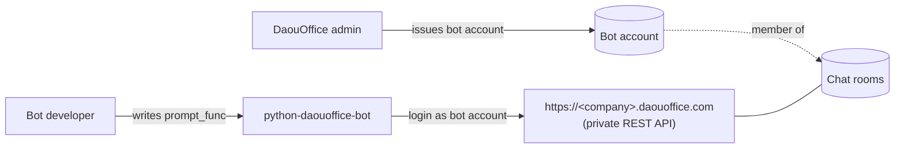
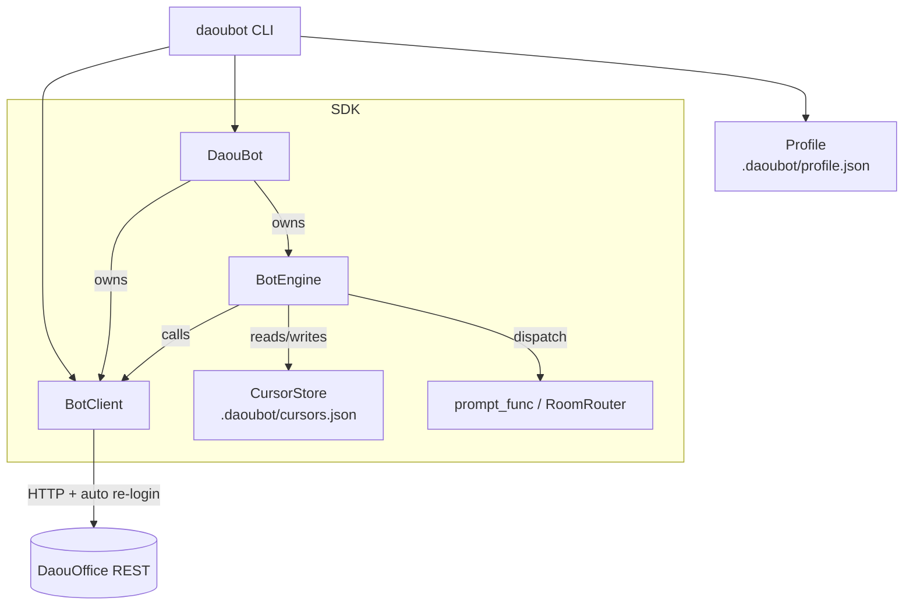
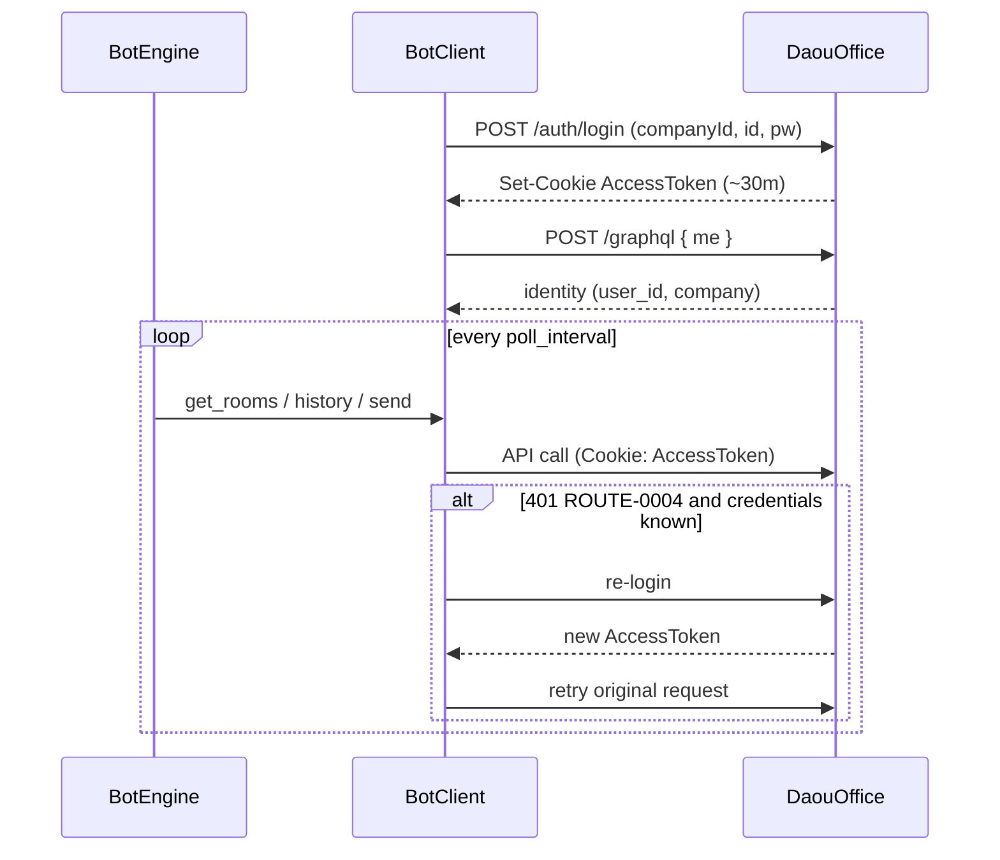
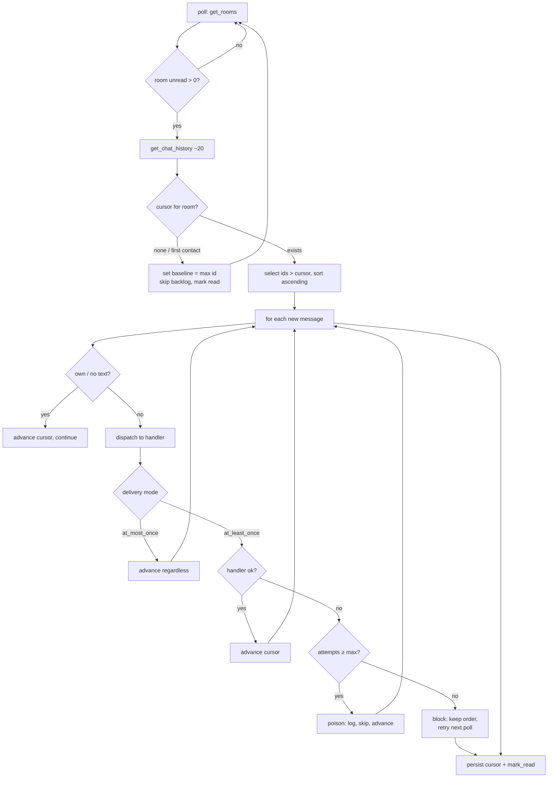
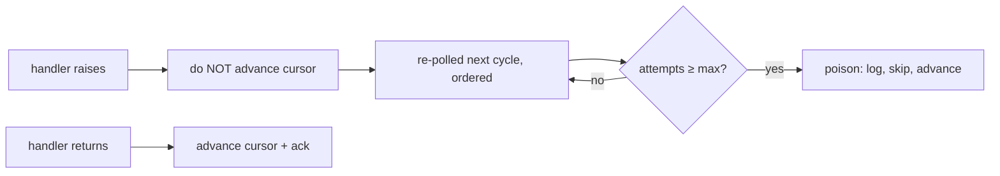

# Architecture

How `python-daouoffice-bot` is designed and **why**. This documents the
decisions reached while building the SDK; it is the reference for contributors.

## 1. Context

DaouOffice messenger has **no official bot API**. This SDK drives the same
private REST API the PC messenger uses, reconstructed from a Fiddler (SAZ)
capture. There is **no BotFather**: a "bot" is an ordinary DaouOffice account an
administrator issues for automation. Membership in a room *is* the connection —
no per-room install/OAuth step.

### Non-goals

- **Not** an LLM framework. LLM calls live in the developer's `prompt_func`
  (see `examples/bot-assistant`), never in the SDK.
- **Not** tied to one tenant. Every tenant value (`base_url`, `company_id`,
  identity) is supplied or auto-resolved, never hard-coded.
- **Polling only.** A WebSocket/STOMP endpoint was seen in the capture but
  never validated, so it is **not implemented** (no speculative code shipped);
  kept as reverse-engineering notes for possible future work.

## 2. Components

| Component | Responsibility |
|---|---|
| `BotClient` | Stateless-ish REST wrapper: login, GraphQL `me` identity, rooms, messages, read receipts. Multi-tenant. Auto re-login on 401. |
| `BotEngine` | Poll loop, per-room ordered dispatch, cursor/ack, delivery guarantee. |
| `DaouBot` | High-level facade: wires client + engine, exposes `prompt_func`. |
| `RoomRouter` | Allowlist-by-default per-room handler dispatch. |
| `CursorStore` | Where "how far processed" is persisted (`Memory` / `File`). |
| `Profile` | CLI session/identity persistence so commands skip re-auth. |

Layering principle: **transport/bookkeeping lives in the engine/client; the
developer writes a pure `prompt_func`.** This mirrors Telegram/Discord/Matrix/
Kafka clients, where consumer offset is framework-owned, not application code.

## 3. Authentication & session lifecycle

AccessToken JWT lives ~30 min; the full SAZ capture shows **no token-refresh
endpoint**. DaouOffice also allows many concurrent sessions per account. So the
recovery strategy is **re-login on 401** (`ROUTE-0004`), which is safe because a
fresh login is just another session.

`company_id` can be discovered without auth from
`/api/portal/public/auth/company` (`data.companyList[0]`), powering
`daoubot discover` / `daoubot login` onboarding.

## 4. Polling & cursor flow

The only inbound signal is `unreadMessageCount > 0` per room — inherently
**level-triggered** (stays hot until read). The engine turns that into ordered,
exactly-tracked delivery using a per-room cursor (`chatMessageId`).

**First-contact baseline:** on the first ever sighting of a room the backlog is
*not* replayed — the bot only reacts to messages that arrive while it runs.
After that the cursor (persisted) drives resume-after-restart.

## 5. Delivery guarantee (fixed: at-least-once)

Advancing the cursor == acknowledging a message, so *when* we advance defines
the guarantee. The SDK does not expose this as a knob: **at-least-once is the
message-delivery industry standard** (Kafka/SQS/Slack/Telegram) and the right
default for a chat bot ("never silently drop a user's message"). Offering
at-most-once as a mode would mostly invite accidental, silent message loss.

- The SDK guarantees *transport* at-least-once; **business idempotency is the
  handler's job** — make `prompt_func` idempotent if a duplicate reply matters.
- A failing message is retried **in order** per room (a stuck message blocks
  newer ones) until it succeeds or hits `max_attempts` → poison, skipped.
- Read receipts follow this: marks read only up to the last acked message, so a
  failed one stays unread and is re-polled; the room is fully cleared only when
  nothing is pending.
- **Fire-and-forget** is not a separate mode — a handler that swallows its own
  errors never "fails", so it is never retried (userland escape hatch).

> Decision history: an earlier iteration exposed a `delivery=` knob
> (`at_least_once`/`at_most_once`, epoll-mode style). It was removed: a
> delivery-semantics choice offloads a distributed-systems decision onto every
> bot author and the at-most-once path is a silent-loss footgun. A standard
> exists — the SDK follows it instead of delegating the responsibility.

## 6. State on disk (`.daoubot/`, gitignored)

| File | Written by | Contents | Secret? |
|---|---|---|---|
| `profile.json` | `daoubot login` | tenant + identity + session token | token yes (no password) |
| `cursors.json` | engine (`FileCursorStore`) | `room_id → last handled id` | no |

## 7. Key decisions

| Decision | Rationale |
|---|---|
| Multi-tenant, nothing hard-coded | DaouOffice is per-company SaaS; library must serve any tenant. |
| Auto-resolve identity via GraphQL `me` | Removes hard-coded bot user id; needed to skip own messages. |
| Re-login on 401, not RefreshToken | SAZ shows no refresh endpoint; multi-session makes re-login safe. |
| Engine owns the cursor/ack | Conventional (Telegram/Kafka/Matrix); the platform gives no server-side queue, so pushing it to handlers would force every author to solve a distributed-systems problem. |
| Delivery fixed at at-least-once (no knob) | It is the message-delivery standard; a configurable at-most-once is a silent-loss footgun. Follow the standard, don't delegate the decision. |
| RoomRouter = allowlist by default | A bot account can be dragged into any room; replying everywhere is a footgun. |
| Mentions: SDK parses, gating is declarative (no knob) | Token parsing is platform knowledge the SDK must own; "all vs mention-only" has no single right answer, so it is a composable filter (`only_when_mentioned`), not a global mode — same principle as the dropped delivery knob. |
| LLM excluded from SDK | Single responsibility (messaging). LLM is a handler concern; shown by example. |
| Polling only; no WebSocket code | REST is fully reverse-engineered and stable; the STOMP flow was never validated, so shipping speculative WS code would mislead. Documented as notes only. |

## 8. Known limitations

- Restart catch-up is bounded by the ~20-message history window (no "since id"
  endpoint). Long downtime loses out-of-window messages.
- Read state is **account-global**: use a dedicated bot account, never shared
  with a human (the bot's `mark_read` clears their unread too).
- Do not run multiple bot processes on one account (duplicate handling, races);
  scale with `RoomRouter` in one process, not by cloning accounts.
- Unofficial: depends on a private API and can break on server changes.
