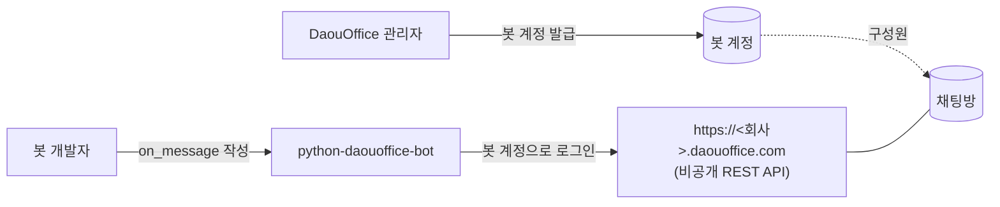
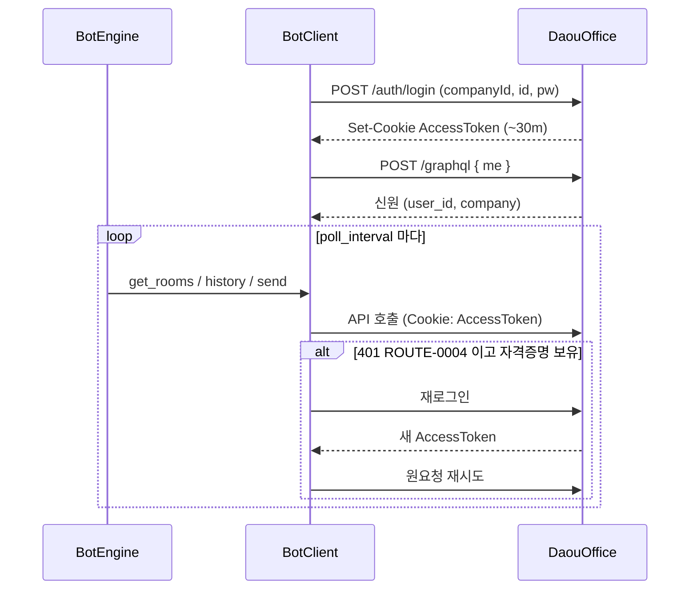
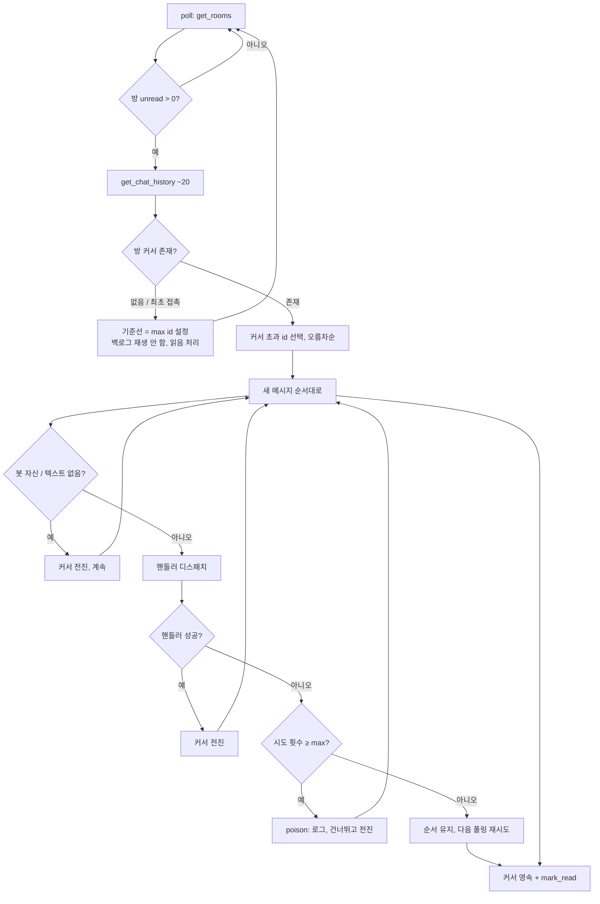

# 아키텍처

`python-daouoffice-bot` 의 현재 설계와 **그 근거**. 코드의 현재 상태만 기술한다 — 변경 이력은 커밋 로그·CHANGELOG에 있다.

## 1. 컨텍스트

DaouOffice 메신저에는 **공식 봇 API가 없다.** 이 SDK는 PC 메신저가 쓰는 비공개 REST API를 SAZ(Fiddler) 캡처로 역분석해 구동한다. BotFather 같은 등록 체계가 없다 — "봇"은 관리자가 자동화용으로 발급한 일반 DaouOffice 계정이고, 방의 구성원이 되는 것 **자체가 연결**이다(방별 설치/OAuth 단계 없음).

### 일반 봇 플랫폼과 무엇이 다른가

Telegram/Slack/Discord 는 봇 *플랫폼* 을 준다: 등록 체계(BotFather / 앱+OAuth / 개발자 포털), 토큰, 범위가 한정된 권한, 푸시 전달(웹훅 / Events / Gateway). DaouOffice 에는 그게 **전혀 없다.** 그래도 ChatOps·알림·어시스턴트 수요는 같으므로, 유일한 경로는 PC 메신저의 비공개 REST를 역분석하는 것이다. 이 프로젝트는 그 역분석과 아래의 비자명한 운영 제약을 한곳에 캡슐화한다.

봇 생성 *절차* 가 근본적으로 다르고, 그 차이가 설계 전체를 규정한다:

| 일반 봇과의 차이 | 이 SDK의 설계 귀결 |
|---|---|
| 등록·토큰 없음 — 봇은 관리자 발급 **일반 계정** | 계정 로그인 인증; GraphQL `me` 로 신원 해석; 토큰 붙여넣기 대신 `daoubot discover`/`login` 온보딩 |
| 방별 설치 없음 — **구성원 = 연결** | "연결" 단계 없음; 대신 `RoomRouter` allowlist 로 끌려 들어간 방 전부에 응답하지 않게 함 |
| 범위 한정 봇 토큰이 아니라 계정 권한 | **전용 계정** 필수; `mark_read` 가 계정 전역(§6) |
| 푸시 없음 — 공유 REST를 **폴링** | 방별 커서·at-least-once·재시작 복구를 갖춘 폴링 엔진(§4–5) |
| 세션 ~30분, 갱신 엔드포인트 없음 | 401 시 투명 재로그인(§3) |
| 회사별 SaaS, 미문서화 | 하드코딩 없는 멀티테넌트; 모든 사실에 "SAZ 기반/라이브 미검증" 정직 표기 |

즉 이 SDK는 "DaouOffice용 Telegram 스타일 프레임워크"가 아니라 *그 절차와 귀결의 캡슐화* 다. 이 문서의 나머지는 각 귀결의 근거다.

### 비목표

- **LLM 프레임워크 아님.** LLM 호출은 개발자의 `on_message` 안에 둔다(예: `examples/bot-assistant`). SDK는 LLM을 번들하지 않는다.
- **단일 테넌트에 묶이지 않음.** `base_url`·`company_id`·신원 등 모든 테넌트 값은 주입되거나 자동 해석되며 하드코딩하지 않는다.
- **폴링 전용.** 캡처에 WebSocket/STOMP 엔드포인트가 보이나 흐름을 검증하지 못해 구현하지 않는다(추측성 코드 미포함). 향후 작업용 역분석 메모로만 남긴다.

## 2. 구성 요소

| 구성 요소 | 책임 |
|---|---|
| `BotClient` | REST 래퍼: 로그인, GraphQL `me` 신원, 방·메시지·첨부·읽음 처리. 멀티테넌트. 401 자동 재로그인. 모든 요청에 `X-Referer-Info`(테넌트 호스트) 부착. |
| `BotEngine` | 폴링 루프, 방별 순서 디스패치, 커서/ack, 전달 보장. |
| `DaouBot` | 고수준 파사드: client+engine 결선, `on_message` 노출. |
| `RoomRouter` | allowlist 기본 방별 핸들러 분기. |
| `CursorStore` | "어디까지 처리했는지" 영속 위치(`Memory`/`File`). |
| `Profile` | CLI 세션/신원 영속 — 명령이 재인증 없이 동작. |

레이어링 원칙: **트랜스포트·기록은 엔진/클라이언트가, 개발자는 순수 `on_message` 만 작성.** Telegram/Discord/Matrix/Kafka 클라이언트와 같은 모델로, 소비 오프셋은 프레임워크 소유이지 애플리케이션 코드가 아니다.

## 3. 인증 & 세션 수명주기

AccessToken JWT 수명은 약 30분이고, 캡처 전체에 토큰 갱신 엔드포인트가 없다. DaouOffice 는 계정당 다중 동시 세션을 허용한다. 따라서 복구 전략은 **401(`ROUTE-0004`) 시 재로그인** 이며, 새 로그인은 또 다른 세션일 뿐이라 안전하다.

`company_id` 는 인증 없이 `/api/portal/public/auth/company`(`data.companyList[0]`)에서 얻을 수 있다. 이 공개 엔드포인트는 인증 쿠키가 없으므로 `X-Referer-Info`(테넌트 호스트) 헤더로 테넌트를 식별한다 — 그래서 클라이언트가 모든 요청에 그 헤더를 붙인다. `daoubot discover`/`login` 온보딩이 이를 사용한다.

## 4. 폴링 & 커서 흐름

유일한 인바운드 신호는 방별 `unreadMessageCount > 0` — 본질적으로 레벨 트리거(읽음 처리 전까지 hot 유지). 엔진은 이를 방별 커서(`chatMessageId`)로 순서 있고 정확히 추적되는 전달로 바꾼다.

**최초 접촉 기준선:** 어떤 방을 처음 본 시점에는 백로그를 재생하지 않는다 — 봇은 *실행 중에 도착한* 메시지에만 반응한다. 그 뒤로는 (영속된) 커서가 재시작 후 이어받기를 주도한다.

## 5. 전달 보장 — at-least-once

커서 전진 == 메시지 ack 이므로, *언제* 전진하느냐가 보장 수준을 정한다. 이 SDK는 이를 노브로 노출하지 않는다: **at-least-once 는 메시지 전달의 업계 표준**(Kafka/SQS/Slack/Telegram)이고 챗봇의 올바른 기본값이다("사용자 메시지를 조용히 버리지 않는다"). at-most-once 를 모드로 제공하면 대개 우발적·조용한 메시지 손실을 부른다.

- SDK는 *트랜스포트* at-least-once 를 보장한다 — **비즈니스 멱등성은 핸들러의 몫**. 중복 응답이 문제면 `on_message` 를 멱등하게 작성한다.
- 실패한 메시지는 방 내에서 **순서대로** 재시도된다(막힌 메시지가 뒤 메시지를 막음). 성공하거나 `max_attempts` 초과 시 poison 처리되어 건너뛴다.
- 읽음 처리도 이를 따른다: 마지막으로 ack된 메시지까지만 읽음 처리하여 실패분은 unread로 남아 재폴링되고, 대기 중인 게 없을 때만 방이 완전히 정리된다.
- fire-and-forget 은 별도 모드가 아니다 — 핸들러가 자기 예외를 삼키면 "실패"로 치지 않으므로 재시도되지 않는다(userland 탈출구).

## 6. 디스크 상태 (`.daoubot/`, gitignore)

| 파일 | 작성 주체 | 내용 | 비밀? |
|---|---|---|---|
| `profile.json` | `daoubot login` | 테넌트 + 신원 + 세션 토큰 + 비밀번호 | 예 (토큰·비밀번호) |
| `cursors.json` | 엔진(`FileCursorStore`) | `room_id → 마지막 처리 id` | 아니오 |

비밀번호는 무인 자동 재로그인을 위해 `profile.json` 에 저장된다 — 파일은 `chmod 600`·`.daoubot/` gitignore 이고, 화면에는 `Profile.public_dict()` 가 `****` 로 마스킹한다(`daoubot login` 출력 등). `--config` 로 프로필 경로를 분리해 한 호스트에서 여러 봇/테넌트를 운용한다.

## 7. 주요 설계 결정

| 결정 | 근거 |
|---|---|
| 멀티테넌트, 하드코딩 없음 | DaouOffice 는 회사별 SaaS; 라이브러리는 임의 테넌트를 섬겨야 한다. |
| GraphQL `me` 로 신원 자동 해석 | 봇 user id 하드코딩 제거; 자기 메시지 스킵에 필요. |
| RefreshToken 이 아니라 401 재로그인 | 캡처에 갱신 엔드포인트 없음; 다중 세션 허용이라 재로그인이 안전. |
| 커서/ack 를 엔진이 소유 | 관례(Telegram/Kafka/Matrix); 서버측 큐가 없으니 핸들러로 떠넘기면 모든 작성자가 분산시스템 문제를 풀어야 한다. |
| 전달은 at-least-once 단일 (노브 없음) | 메시지 전달 표준이며, 구성 가능한 at-most-once 는 조용한 손실 함정. 표준을 따르고 결정을 위임하지 않는다. |
| RoomRouter = allowlist 기본 | 봇 계정은 아무 방에나 초대될 수 있음; 전부 응답은 footgun. |
| 멘션: SDK 파싱, 게이팅은 선언적 | 토큰 파싱은 플랫폼 지식이라 SDK가 소유; "전원 vs 멘션만" 은 정답이 하나가 아니라 조합형 필터(`only_when_mentioned`)로 표현, 글로벌 모드로 두지 않는다. |
| LLM 코어 제외 | 단일 책임(메시징). LLM 은 핸들러 관심사 — 예제로 보여준다. |
| 폴링 전용, WS 코드 없음 | REST 는 완전히 역분석돼 안정적; STOMP 흐름은 미검증이라 추측성 WS 코드는 오해를 부른다. 메모로만 남긴다. |

## 8. 알려진 제약

- 재시작 후 따라잡기는 약 20개 히스토리 창 안으로 제한된다("since id" 엔드포인트 없음). 그보다 오래 다운되면 창 밖 메시지는 복구 불가.
- 읽음 상태는 **계정 전역** — 전용 봇 계정을 쓰고 사람과 공유하지 않는다(봇의 `mark_read` 가 그 사람 unread 까지 지움).
- 한 계정으로 봇 프로세스를 여럿 띄우지 않는다(중복 처리·`mark_read` 경합). 한 프로세스 안에서 `RoomRouter` 로 확장한다.
- 비공식: 비공개 API에 의존하므로 서버 변경 시 깨질 수 있다. 계약은 SAZ 기반이며 라이브 검증 전까진 미검증이다.
